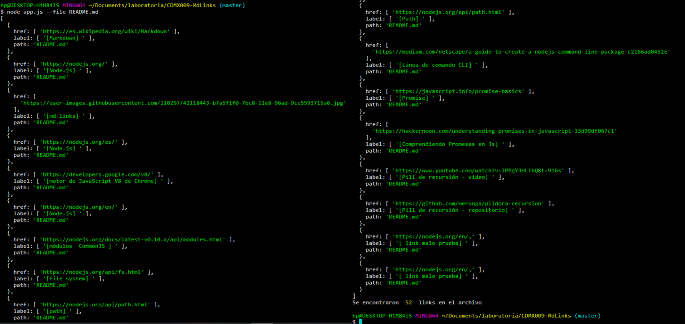
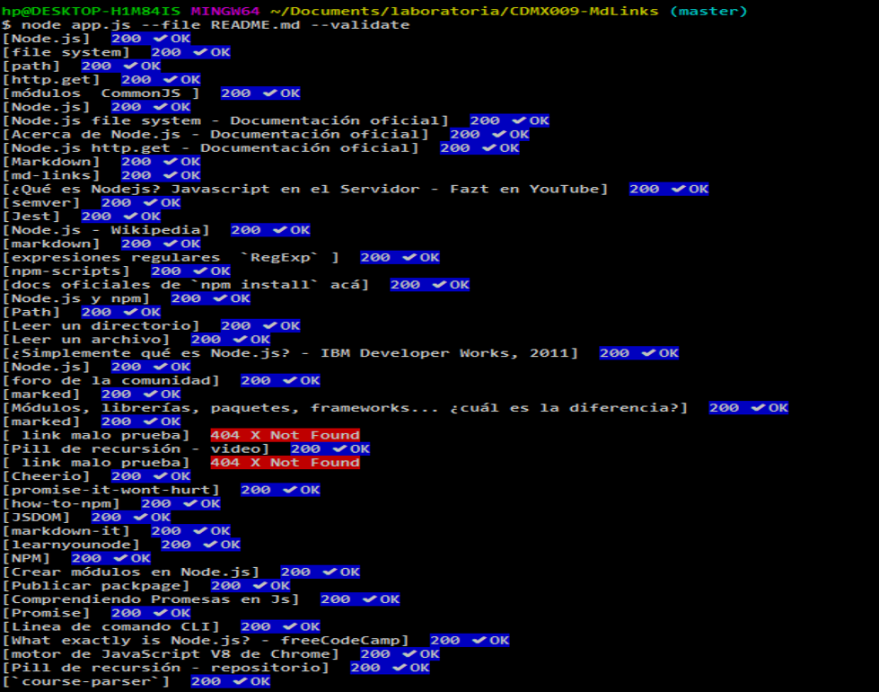
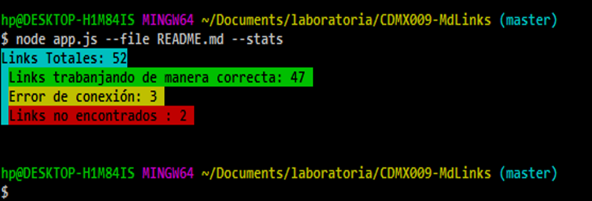
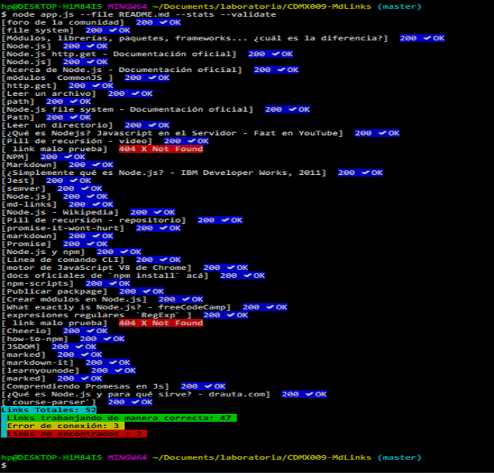

# Manual sharidLinks

"sharidLinks" es una librería que facilita la lectura de links que existen en archivo ".md" y así poder validarlos y crear una estadística de los links (Total, Respuesta 200 y Respuesta 404).

## Funcionalidad 

•Si únicamente leemos el archivo con --file se obtienen y muestran los links que existen en el archivo (es importante mencionar que solo accede a archivos con extensión ".md")
 

• La opción --validate muestra el texto del hipervínculo, el status y una pequeña leyenda del status (ejem. "200 ✔OK" o "404 X Not Found").
 

• La opción --stats regresa el conteo de los links "buenos", "rotos", "con error de conexión" y el total de estos.
     

• Por ultimo en caso de querer validar los links y saber las estadísticas se utilizan las 2 flags juntas --validate --stats
    

