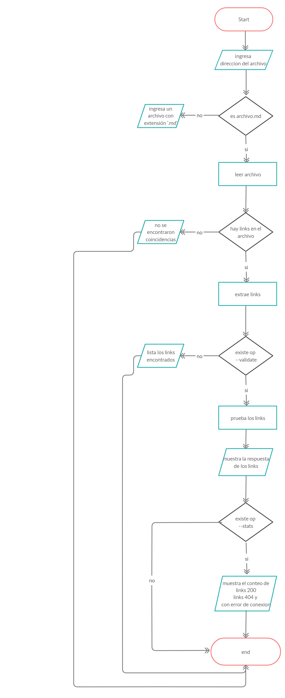

# Manual sharidLinks

"sharidLinks" es una librería que facilita la lectura de links que existen en un archivo con extensión  ".md" para poder validarlos y crear una estadística de estos (Total, Respuesta 200, Respuesta 404, con error de conexión).

## Diagra de flujo 
 

## Funcionalidad 

•Si solo queremos saber cuales son los links que existen, se utiliza la flag --file

 

• La opción --validate muestra el texto del hipervínculo, el status y una pequeña leyenda del status (ejem. "200 ✔OK" o "404 X Not Found").
 

• La opción --stats regresa el conteo de los links "buenos", "rotos", "con error de conexión" y el total de estos.
     

• Por último en caso de querer validar los links y saber las estadísticas se utilizan las 2 flags juntas --validate --stats
    

