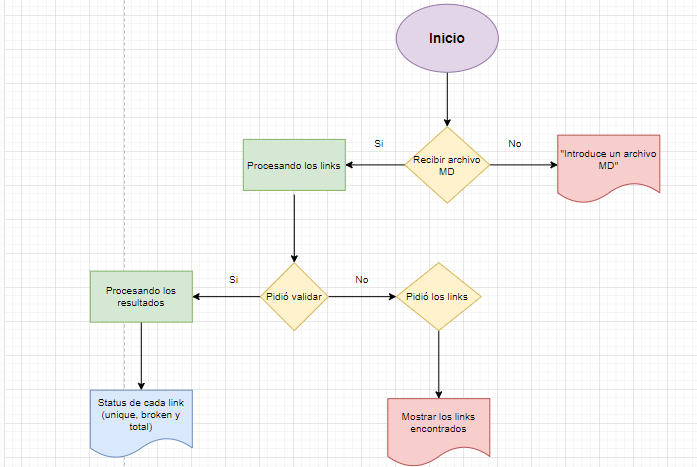
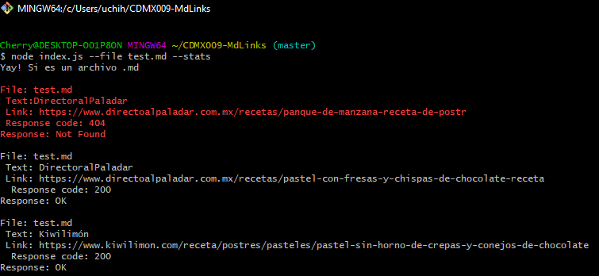
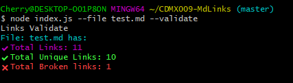
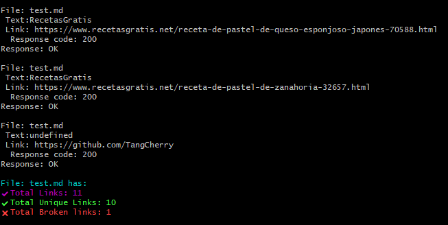

# Markdown Links - Cake Edition :cake:

[Markdown](https://es.wikipedia.org/wiki/Markdown) es un lenguaje de marcado
ligero muy popular entre developers. Es usado en muchísimas plataformas que
manejan texto plano (GitHub, foros, blogs, ...), y es muy común
encontrar varios archivos en ese formato en cualquier tipo de repositorio
(empezando por el tradicional `README.md`).

Estos archivos `Markdown` normalmente contienen _links_ (vínculos/ligas) que
muchas veces están rotos o ya no son válidos y eso perjudica mucho el valor de
la información que se quiere compartir.

Dentro de una comunidad de código abierto, nos han propuesto crear una
herramienta usando [Node.js](https://nodejs.org/), que lea y analice archivos
en formato `Markdown`, para verificar los links que contengan y reportar
algunas estadísticas.

## ¿Cómo se realizó?
Para empeazar, se diseñó un diagrama de flujo para conocer las opciones que debía de tener el usuario al hacer uso de la librería y así estructurar el proyecto orientado al diagrama mientras también se realizaba a la par el test unitario para ver el correcto funcionamiento de las funciones creadas.
Se creó con Nodejs y [chalk](https://www.npmjs.com/package/chalk).

## ¿Qué hace?

La librería reconoce los archivos .md con la flag ####"--file" y el nombre del archivo a revisar. De no entregarle uno con ese formato aparece un mensaje donde te lo solicita.
Cuando tiene el archivo correspondiente puedes pedirle que te entregue el status de cada link encontrado con la flag ####"--stats" o la validación de estos con la flag ####"--validate" o ambos uniendo las flags ####"--validate--stats".

## ¿Cómo lo instalo?

## Objetivos de aprendizaje

Recuerda colocar en esta seccion los objetivos de aprendizaje que quedaron 
pendientes de tu proyecto anterior.

### Javascript
- [ ] Uso de callbacks
- [ ] Consumo de Promesas
- [ ] Creacion de Promesas
- [ ] Modulos de Js
- [ ] Recursión

### Node
- [ ] Sistema de archivos
- [ ] package.json
- [ ] crear modules
- [ ] Instalar y usar modules
- [ ] npm scripts
- [ ] CLI (Command Line Interface - Interfaz de Línea de Comando)

### Testing
- [ ] Testeo de tus funciones
- [ ] Testeo asíncrono
- [ ] Uso de librerias de Mock
- [ ] Mocks manuales
- [ ] Testeo para multiples Sistemas Operativos

### Git y Github
- [ ] Organización en Github

### Buenas prácticas de desarrollo
- [ ] Modularización
- [ ] Nomenclatura / Semántica
- [ ] Linting

