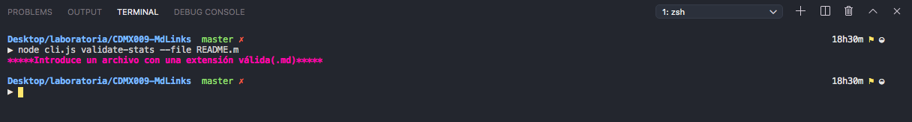
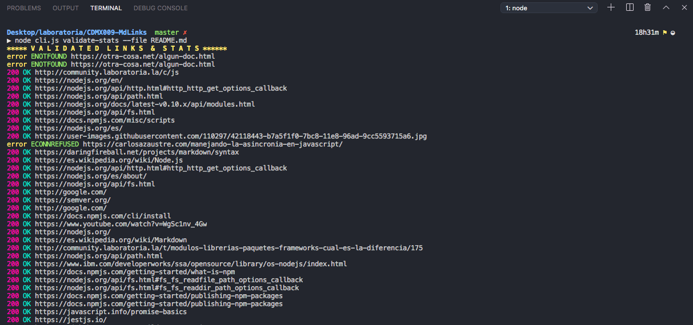
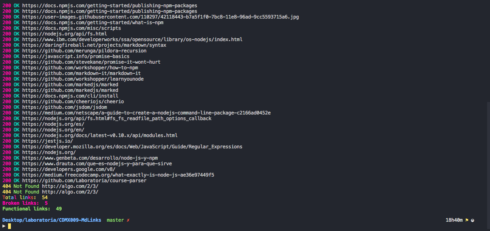
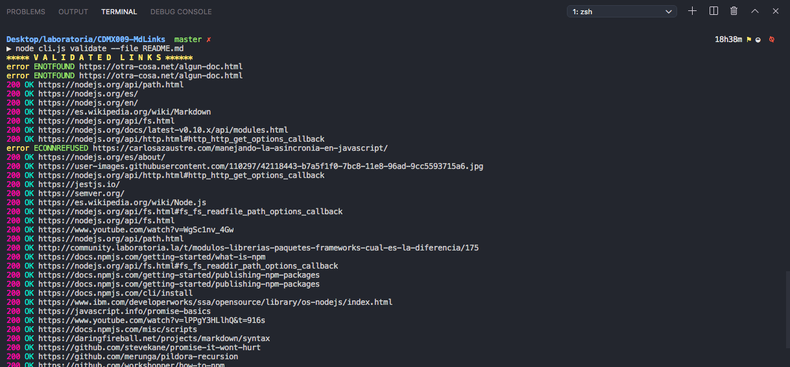
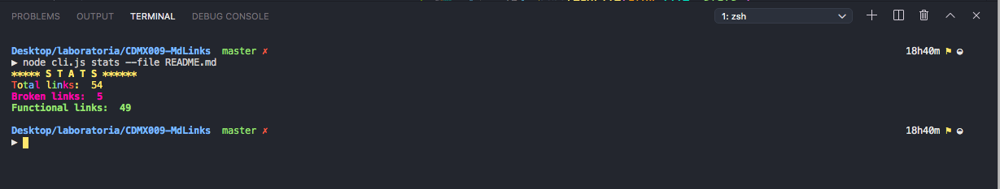
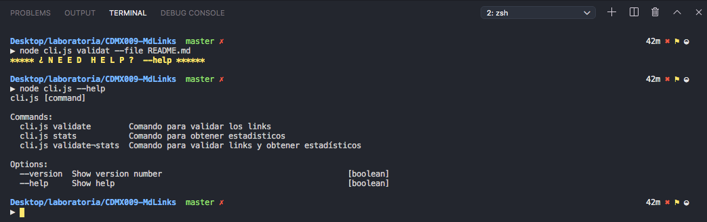

# Markdown Links
Librería desarrollada en node.js que nos permite validar links funcionales y rotos, así como obtener las estadísticas de cada uno de los parámetros anteriormente mencionados.

### Extensión .md
Validación de la extensión .md
Si el archivo no es extensión .md (markdown), el programa no se ejecuta y manda un mensaje de error

### Validando links y oteniendo estadísticas
Si el usuario así lo requiere, se muestran links validados (ya sean rotos o funcionales) y los estadísticos.

### Validando únicamente links
Si el usuario así lo requiere, se muestran únicamente los links validados (ya sean rotos o funcionales).

### Obteniendo únicamente estadísticos
Si el usuario así lo requiere, se muestran únicamente los estadísticos de los links funcionales y de los links rotos.

### Ayuda
Si el usuario no sabe cómo usars la librería, puede ejecutar un comando de ayuda.
