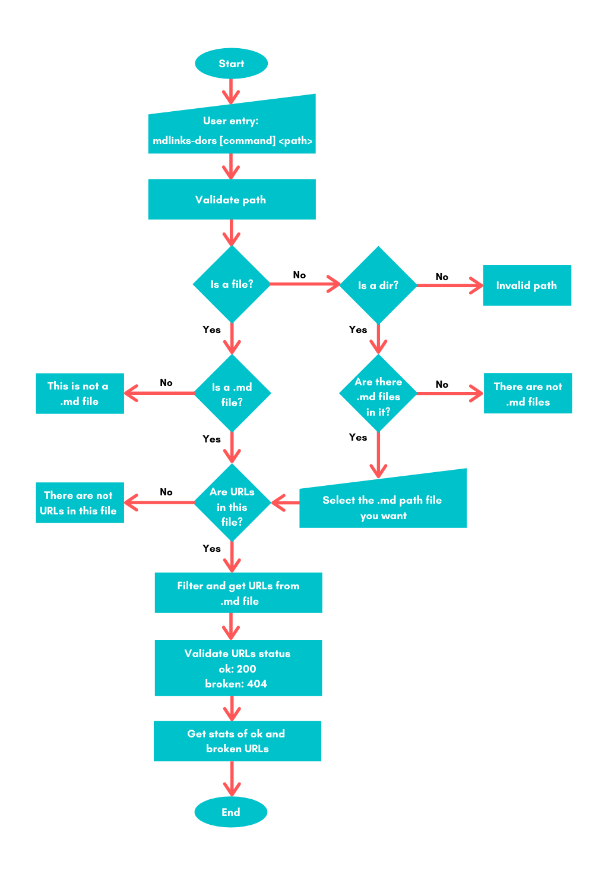

# Project: Markdown Links
mdlinks-dors is a nodejs library to get, validate, and get the stats of the URL links in a markdown file. It was developed in JavaScript and uses four dependencies: node-fetch, yargs, chalk, and jest.

## Install

To install write the following command line:
```
npm i mdlinks-dors 
```

## Usage - Command Line Interface, CLI

To execute the library write the shorcut *mdlinks*, the option *command* and the *path* after the *--file* flag as follows:

```
mdlinks [command] --file <path> 
```
### Options of path

- Single file path
- Directory path unfolds a menu with all .md files in it.

```
$ mdLinks validateStats --file /home/laboratoria159-pm/CDMX009-MdLinks/
Option: ValidateStats
0: /home/laboratoria159-pm/CDMX009-MdLinks/README.md
1: /home/laboratoria159-pm/CDMX009-MdLinks/file.md
2: /home/laboratoria159-pm/CDMX009-MdLinks/file1.md
3: /home/laboratoria159-pm/CDMX009-MdLinks/nofile.md
Select the number of the file path you want:
```
### Options commands

- **validate** command validates URL links status as follow: 
  - status code 200: ok
  - status code 404: broken
```
mdlinks validate --file <path>
```
Results are unfold as an array of objects with URL information: 

```
[
  {
    href: 'https://dzone.com/articles/how-single-page-web-applications-actually-workkk',
    text: 'SPA (algo) otro algo',
    File: '/home/laboratoria159-pm/CDMX009-MdLinks/file1.md',
    code: 404,
    status: 'broken'
  },
  {
    href: 'https://darwindigital.com/mobile-first-versus-responsive-web-design/',
    text: 'mobile first',
    File: '/home/laboratoria159-pm/CDMX009-MdLinks/file1.md',
    code: 200,
    status: 'ok'
  },
  {
    href: 'http://darwindigital.com/mobile-first-versus-responsive-web-design/',
    text: 'mobile',
    File: '/home/laboratoria159-pm/CDMX009-MdLinks/file1.md',
    code: 200,
    status: 'ok'
  }
]
```

- **stats** command get the stats of ok and broken URL links. 
```
mdlinks stats --file <path>
```
Results unfold as follows:
```
Url Ok: 2
Url broken: 1
```

- **validateStats** commadn does both, validate and get tha stats of URL links. 

```
mdlinks validateStats --file <path>
```
Results unfold as a combination of both validate and stats commands. 

```
[
  {
    href: 'https://dzone.com/articles/how-single-page-web-applications-actually-workkk',
    text: 'SPA (algo) otro algo',
    File: '/home/laboratoria159-pm/CDMX009-MdLinks/file1.md',
    code: 404,
    status: 'broken'
  },
  {
    href: 'https://darwindigital.com/mobile-first-versus-responsive-web-design/',
    text: 'mobile first',
    File: '/home/laboratoria159-pm/CDMX009-MdLinks/file1.md',
    code: 200,
    status: 'ok'
  },
  {
    href: 'http://darwindigital.com/mobile-first-versus-responsive-web-design/',
    text: 'mobile',
    File: '/home/laboratoria159-pm/CDMX009-MdLinks/file1.md',
    code: 200,
    status: 'ok'
  }
]
Url Ok: 2
Url broken: 1
```
## Logical flowchart



***

## Objetivos de aprendizaje

Recuerda colocar en esta seccion los objetivos de aprendizaje que quedaron 
pendientes de tu proyecto anterior.

### Javascript
- [x] Uso de callbacks
- [x] Consumo de Promesas
- [x] Creacion de Promesas
- [x] Modulos de Js
- [x] Recursión

### Node
- [x] Sistema de archivos
- [x] package.json
- [x] crear modules
- [x] Instalar y usar modules
- [x] npm scripts
- [x] CLI (Command Line Interface - Interfaz de Línea de Comando)

### Testing
- [x] Testeo de tus funciones
- [x] Testeo asíncrono
- [ ] Uso de librerias de Mock
- [ ] Mocks manuales
- [ ] Testeo para multiples Sistemas Operativos

### Git y Github
- [x] Organización en Github

### Buenas prácticas de desarrollo
- [x] Modularización
- [x] Nomenclatura / Semántica
- [ ] Linting

***
