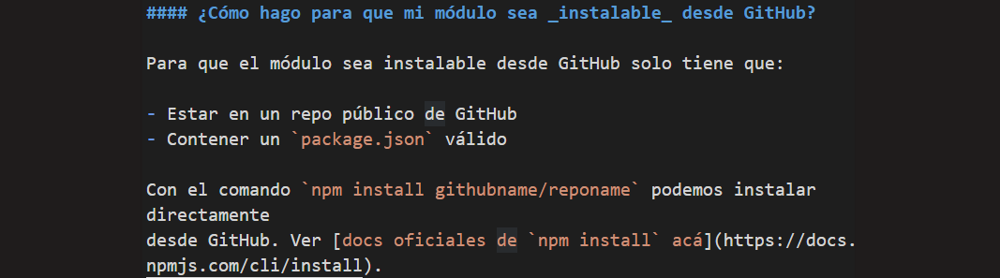
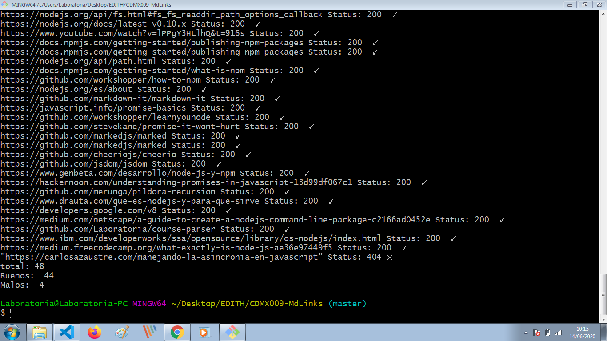

# Markdown Links

## Preámbulo

[Markdown](https://es.wikipedia.org/wiki/Markdown) es un lenguaje de marcado
ligero muy popular entre developers. Es usado en muchísimas plataformas que
manejan texto plano (GitHub, foros, blogs, ...), y es muy común
encontrar varios archivos en ese formato en cualquier tipo de repositorio
(empezando por el tradicional `README.md`).

Estos archivos `Markdown` normalmente contienen _links_ (vínculos/ligas) que
muchas veces están rotos o ya no son válidos y eso perjudica mucho el valor de
la información que se quiere compartir.

Dentro de una comunidad de código abierto, nos han propuesto crear una
herramienta usando [Node.js](https://nodejs.org/), que lea y analice archivos
en formato `Markdown`, para verificar los links que contengan y reportar
algunas estadísticas.

## Diagrama de flujo

Para la realización de este proyecto se elaboró un diagrama de flujo para tener un mejor entendimiento del desarrollo y requerimentos del mismo.

## Demo biblioteca md-links

La demo que contiene este proyecto realiza la evaluación de links válidos y rotos, también devuelve las estadísticas de los links evaluados del archivo markdown.

Para inicializar la evaluación de los links dentro de un archivo markdown primero debe de ejecutar en la terminal lo siguiente: 

~~~
$ ./cli.js <input> --flag

//Ejemplo:

$ ./cli.js example.md --validate
~~~

## Objetivos de aprendizaje

Recuerda colocar en esta seccion los objetivos de aprendizaje que quedaron 
pendientes de tu proyecto anterior.

### Javascript
- ⭐ Uso de callbacks
- ⭐ Consumo de Promesas
- [ ] Creacion de Promesas
- ⭐ Modulos de Js
- [ ] Recursión

### Node
- ⭐ Sistema de archivos
- [ ] package.json
- ⭐ crear modules
- ⭐ Instalar y usar modules
- [ ] npm scripts
- [ ] CLI (Command Line Interface - Interfaz de Línea de Comando)

### Testing
- ⭐ Testeo de tus funciones
- ⭐ Testeo asíncrono
- [ ] Uso de librerias de Mock
- [ ] Mocks manuales
- [ ] Testeo para multiples Sistemas Operativos

### Git y Github
- ⭐ Organización en Github

### Buenas prácticas de desarrollo
- ⭐ Modularización
- [ ] Nomenclatura / Semántica
- [ ] Linting