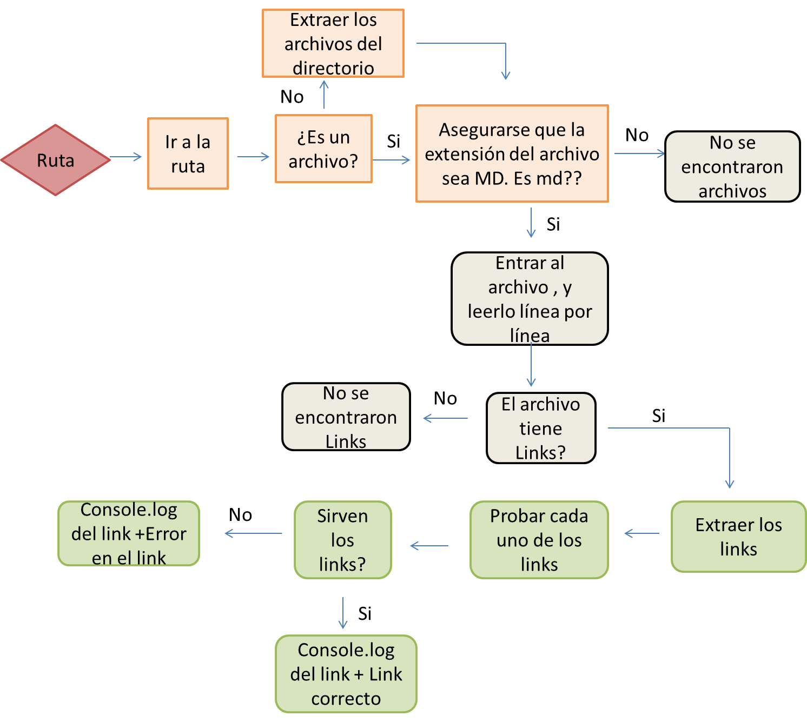

# Markdown Links "dan-mdlinks"
"dan-mdlinks" es una libreria creada con java script para facilitar la extracción y verificación de los links que se encuentran en un archivo markdow (.md)
 
 - Instalar la libreria via `npm install --global danleonca/CDMX009-MdLinks`

 `const danmdlinks = require("dan-mdlinks");`

### CLI (Command Line Interface - Interfaz de Línea de Comando)

El ejecutable de la aplicación es de la de la siguiente
manera a través de la terminal:

`dan-mdlinks --file <path-to-file/directory> [options]`

Para acceder a las opciones puedes ejecutar 

`dan-mdlinks --help`

    --v         validate

    --validate  validate

    --s         stats

    --stats     stats
    
    --s/--stats && --v/--validate  stats & validate

### Las opciones pueden ser:
validar los links regresa un objeto donde puedes ver el path del archivo de donde se extrajo el link, el texto que tiene el link, el link, el estatus del link, y si se encuentra OK o Bad 

    --v         validate
    --validate  validate

La opcion stats muestra estdísticas simples, donde puedes consultar cuantos links únicos se encuentran en cada uno de tus archivos, y cuantos de ellos se encuentran ok y cuantos Bad

    --s         stats
    --stats     stats

De igual forma se pueden combinar ambas opciones para tener acceso a toda la información

    --s/--stats && --v/--validate  stats & validate

## La lógica que sigue el proyecto se basa en  en el siguiente diagrama :

### Javascript
- [ ] Uso de callbacks
- [ ] Consumo de Promesas
- [ ] Creacion de Promesas
- [ ] Modulos de Js
- [ ] Recursión

### Node
- [ ] Sistema de archivos
- [ ] package.json
- [ ] crear modules
- [ ] Instalar y usar modules
- [ ] npm scripts
- [ ] CLI (Command Line Interface - Interfaz de Línea de Comando)

### Testing
- [ ] Testeo de tus funciones
- [ ] Testeo asíncrono
- [ ] Uso de librerias de Mock
- [ ] Mocks manuales
- [ ] Testeo para multiples Sistemas Operativos

### Git y Github
- [ ] Organización en Github

### Buenas prácticas de desarrollo
- [ ] Modularización
- [ ] Nomenclatura / Semántica
- [ ] Linting

